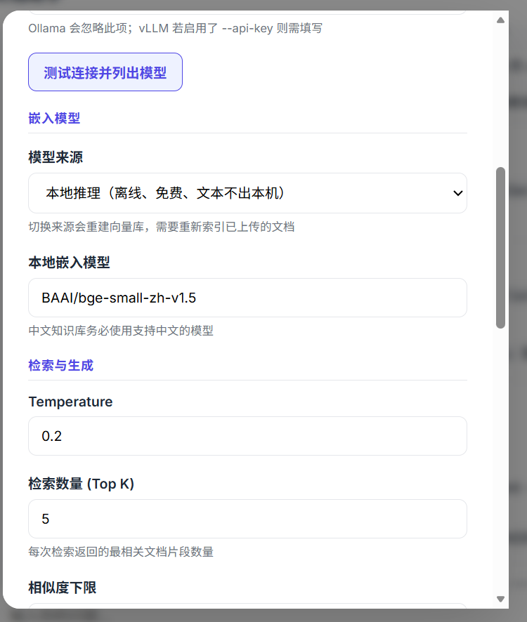
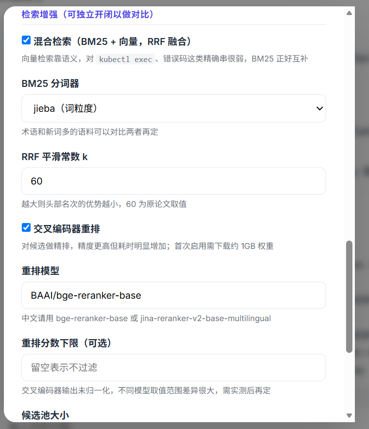

# RAG 智能文档助手

面向企业内部文档的在线问答系统：上传资料、自动建库，结合检索增强生成（RAG）流式回答，并附章节级出处。

## 功能

- **智能问答** — 混合检索 + 大模型生成，回答带参考来源
- **文档管理** — 拖拽上传、自动切分索引，支持一键重建
- **多轮对话** — 支持上下文追问；检索侧可改写指代问题
- **模型配置** — 页面内切换 LLM / 嵌入 / 检索开关，热重载无需重启
- **Docker 部署** — `docker compose up` 一键启动（模型构建时预下载）

## 界面






## 快速开始

```bash
python -m venv .venv
.venv\Scripts\activate          # Windows
pip install -r requirements.txt

cp env.example .env             # 填入 API Key 或自建 LLM 地址
python main.py
```

浏览器打开 `http://localhost:8000`。

**Docker：**

```bash
cp env.docker.example .env
docker compose up --build
```

常用环境变量见 `env.example`（对话走云端或 Ollama/vLLM、嵌入默认本地 BGE、混合检索与重排开关等）。

## 技术栈

| 层次 | 选型 |
|------|------|
| 后端 | FastAPI · uvicorn · 全异步 |
| 向量库 | ChromaDB（本地持久化） |
| 嵌入 | fastembed / BGE-small-zh（默认本地 ONNX） |
| 检索 | 稠密向量 · BM25 · RRF 融合 · Cross-Encoder 重排 |
| 大模型 | OpenAI 兼容接口（DashScope / Ollama 等） |
| 前端 | 原生 HTML/CSS/JS · SSE 流式 · DOMPurify |

## 评测结果

在真实企业语料（196 块、49 条中文问题）上，对四种检索组合做消融（`top_k=5`，嵌入 `bge-small-zh-v1.5`）：

**关键词指标（Hit@K / MRR）**

| 组合 | Hit@5 | MRR | 相对 baseline |
|------|-------|-----|---------------|
| baseline（仅向量） | 75.0% | 0.588 | — |
| + hybrid（BM25+RRF） | 86.4% | 0.749 | MRR +27.5% |
| + rerank | 81.8% | 0.726 | MRR +23.6% |
| hybrid + rerank | **86.4%** | **0.790** | **MRR +34.4%** |

**RAGAS 检索质量（LLM 裁判，49 题）**

| 组合 | context_precision | context_recall |
|------|-------------------|----------------|
| baseline | 0.599 | 0.706 |
| hybrid | 0.721 | 0.871 |
| rerank | 0.755 | 0.804 |
| hybrid + rerank | **0.782** | **0.869** |

复现：`scripts/retrieval_sweep.py`（召回指标）、`scripts/ragas_eval.py`（RAGAS）。示例问题集见 `eval/questions.example.jsonl`，真实项目用到的数据集有敏感信息没有upload。
