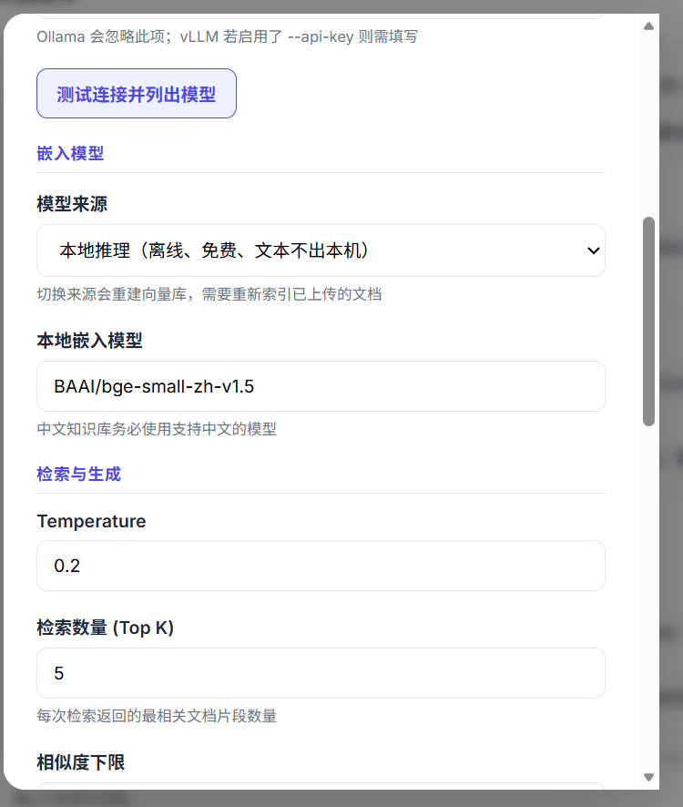
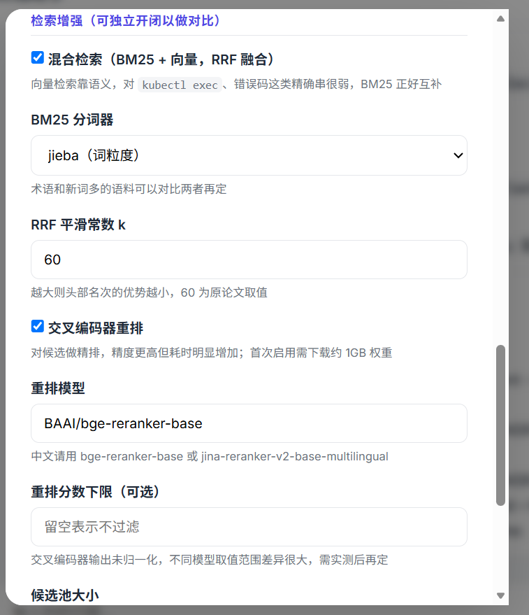

# RAG 智能文档助手

面向企业内部文档的在线问答系统：上传资料、自动建库，结合检索增强生成（RAG）流式回答，并附章节级出处。

## 功能

- **智能问答** — 混合检索 + 大模型生成，回答带参考来源
- **文档管理** — 拖拽上传、自动切分索引，支持一键重建
- **多轮对话** — 支持上下文追问；检索侧可改写指代问题
- **模型配置** — 页面内切换 LLM / 嵌入 / 检索开关，热重载无需重启
- **Agent 模式（可选）** — 模型自选取材方式（语义检索 / 按章节取全 / 全库字面查找），
  一次不够会换一种方式再取，界面上可看到取材进度
- **可观测** — 每问一个 trace_id；token、成本、首 token 与分阶段耗时进结构化日志与
  Prometheus 指标
- **在线反馈** — 答案下方 👍/👎，差评连同当时取回的资料一并留痕，可一键导成回归题集
- **两种运行模式** — 一个开关切换「管理员全功能」与「只给使用者的纯对话界面」，
  后者连管理接口和脚本都不下发
- **Docker 部署** — `docker compose up` 一键启动（模型构建时预下载）

## 界面






## 快速开始

```bash
python -m venv .venv
.venv\Scripts\activate          # Windows
pip install -r requirements.txt

cp env.example .env             # 填入 API Key 或自建 LLM 地址
python main.py
```

浏览器打开 `http://localhost:8000`。

**Docker：**

```bash
cp env.docker.example .env
docker compose up --build
```

常用环境变量见 `env.example`（对话走云端或 Ollama/vLLM、嵌入默认本地 BGE、混合检索与重排开关等）。

### 依赖文件

| 文件 | 用途 |
|------|------|
| `requirements.txt` | 跑服务（Docker 也只装这份） |
| `requirements-dev.txt` | 开发 + 单元测试 |
| `requirements-eval.txt` | 可选：RAGAS 评测与 PDF 转语料（体积大，按需安装） |
| `requirements-agent.txt` | 可选：Agent 模式（langchain），默认关闭不需要 |

### 两种运行模式

`ADMIN_ENABLED` 决定这次启动带不带管理面，**默认关闭**：

| | `ADMIN_ENABLED=false`（默认） | `ADMIN_ENABLED=true` |
|---|---|---|
| 界面 | 只有对话框与 👍/👎 | 加上文档管理侧栏、模型配置弹窗 |
| 文档上传 / 删除 / 重建索引 | 不可用 | 可用 |
| 模型与检索参数配置 | 不可用 | 可用 |
| `/api/retrieve`、`/api/agent` 调试端点 | 不可用 | 可用 |
| `/docs`、`/redoc`、`/openapi.json` | 关闭 | 开启 |

```bash
python main.py                                   # 使用者模式（按 .env）
$env:ADMIN_ENABLED='true'; python main.py        # 临时以管理模式启动（PowerShell）
ADMIN_ENABLED=true python main.py                # 同上（bash）
```

典型用法是：平时以使用者模式对外提供服务；要加文档或改模型时，停掉并以管理模式起一次，
配好之后再切回来。配置落在 `settings.json`、向量库落在 Qdrant（本地目录或独立服务），
所以切回使用者模式读到的就是刚配好的结果。

> **不是靠前端隐藏做到的。** 关闭时管理端点整个 router 不注册，路径返回 404 而不是 403
> —— 403 等于确认「这里有个接口，只是你没权限」。页面上的管理区块也在服务端从 HTML 里
> 剔除后再下发，所以使用者拿到的页面里没有任何管理脚本或端点名。
>
> 同理 `/api/health` 只报前端渲染需要的开关，**不含端点地址与模型名**；
> 完整信息在管理面的 `/api/health/detail`。
>
> 这套隔离与 `APP_API_TOKEN` 是两回事：前者管「这份部署有没有管理面」，
> 后者管「谁能调接口」，公网暴露时两个都要配。

目前建议只起一个窗口（不建议再开一个端口跑管理模式）：Qdrant 本地模式下同一目录只能被一个进程打开，
第二份会直接启动失败；连的是 Qdrant 服务时虽然能起来，但 BM25 索引在各进程内存里，
管理实例新上传的文档，使用者那份的混合检索要重启才看得到。

## 测试

```bash
pip install -r requirements-dev.txt
pytest                          # 离线测试，无需 API Key / 模型权重
```

针对**已启动的服务**做 HTTP 冒烟（真实嵌入 + 真实接口）：

```bash
python main.py                  # 另开终端
python scripts/smoke_test.py    # 默认 http://127.0.0.1:8000
```

接入 LLM 前可先检查端点是否通：

```bash
python scripts/check_llm.py
python scripts/check_llm.py --base-url http://192.168.1.10:11434/v1 --model qwen2.5:7b
```

首次使用本地嵌入/重排前，可预下载模型权重（避免首次索引时卡住）：

```bash
python scripts/download_model.py
python scripts/download_model.py --reranker   # 重排模型约 1GB
```

## 评测

公开示例数据在 `eval/corpus.example/` 与 `eval/questions.example.jsonl`，可直接跑通流程。

> 评测按成本分三层：确定性指标（不调 LLM，秒级）→ RAGAS 裁判（调 LLM，贵）→
> 固定管道对照组。每层解决的问题不同，跳过前两层直接跑 RAGAS 只会烧钱且难归因。
> 各脚本的分工见下文，题集字段的含义见 `eval/README.md`。

**1. 召回消融（Hit@K / MRR，不调 LLM 生成）**

```bash
pip install -r requirements-dev.txt   # 已含主线依赖

python scripts/validate_questions.py eval/questions.example.jsonl --corpus eval/corpus.example
python scripts/retrieval_sweep.py --questions eval/questions.example.jsonl --corpus eval/corpus.example
```

**2. RAGAS（LLM 裁判，评检索与生成质量）**

```bash
pip install -r requirements-eval.txt

# 只评检索类指标（省调用）
python scripts/ragas_eval.py --questions eval/questions.example.jsonl \
    --corpus eval/corpus.example --metrics context_precision,context_recall

# 完整评测（需配置 .env 中的 LLM）
python scripts/ragas_eval.py --questions eval/questions.example.jsonl --corpus eval/corpus.example
```

仅导出样本、不装 ragas 也可：

```bash
python scripts/ragas_eval.py --questions eval/questions.example.jsonl \
    --corpus eval/corpus.example --dump-only
```

**3. 其他**

| 命令 | 说明 |
|------|------|
| `python scripts/agent_eval.py` | 测 Agent 的**准确性**：工具选择正确率、来源命中率等确定性指标；`--dump` 导出的样本可直接喂给 `ragas_eval.py --samples` |
| `python scripts/agent_smoke.py` | 测 Agent 的**代价**（选了哪个工具、调了几次模型、耗时），调参前后可用 `--json` / `--baseline` 对照 |
| `python scripts/pdf_to_markdown.py 手册.pdf` | PDF 转可入库文本（评测语料准备） |
| `python scripts/docker_verify.py` | Docker 部署后健康检查 |
| `POST /api/retrieve` | 只检索不生成，便于调试召回（属管理面，需 `ADMIN_ENABLED=true`） |

本地若有完整语料与问题集（未上传 Git），把路径换成 `eval/corpus`、`eval/questions.hss.jsonl` 即可。详见 `eval/README.md`。

## Agent 模式（可选）

默认关闭。打开后 `/api/chat` 改走 langchain 的 `create_agent`：模型自己决定
用哪个工具、调几次，然后基于取回的资料作答。

| 工具 | 解决的问题 |
|------|-----------|
| `search_docs` | 内容型问题（语义检索，即现有三段式管道） |
| `expand_section` | 「这一节的完整步骤是什么」——把命中片段还原成整节，步骤跨片段时 `top_k` 调多大都没用 |
| `find_literal` | 「所有出现 X 的地方」——要列全，`top_k` 会悄悄截断 |

按文档、章节的过滤都下推给向量库；`find_literal` 的子串判断在进程内做
（Qdrant 的全文匹配是分词匹配，对中文和标识符片段不是子串语义）。
`expand_section` 只能扩展 `search_docs` 已经命中的片段，
所以典型流程是「检索定位 → 扩展取全」的两轮取材。

```bash
pip install -r requirements-agent.txt
# .env 里设 AGENT_ENABLED=true
```

代价是每问多 1~3 次 LLM 调用，所以默认关闭。
`POST /api/agent` 不受开关约束，返回答案、agent 实际看到的 `contexts`、
完整事件轨迹与 `stages`，用于评测对照。

### 怎么评测 Agent

⚠️ **`ragas_eval.py` 与 `retrieval_sweep.py` 直接构造 `RAGEngine`，测的是固定管道。**
即使 `AGENT_ENABLED=true`，它们评的也不是 agent——没有报错，数字看起来却完全正常。

agent 多了一个「取材方式选得对不对」的失败维度，RAGAS 对它是盲的
（用 `search_docs` 回答「列出所有 X」，答案不全但每句都有出处，`faithfulness` 照样高分）。
所以分三层：

```bash
# 1) 快循环：只看路由，确定性判定，不花评委成本
python scripts/agent_eval.py --questions eval/questions.agent.example.jsonl

# 2) 要下结论：导出样本交给现有 RAGAS，那边一行都不用改
python scripts/agent_eval.py --questions eval/questions.hss.jsonl \
    --dump eval/agent_samples.jsonl
python scripts/ragas_eval.py --samples eval/agent_samples.jsonl

# 3) 对照组：同一批问题在固定管道上跑一次，两边比分数
python scripts/ragas_eval.py --questions eval/questions.hss.jsonl --dump-only
```

第 3 步最重要：agent 延迟高一个数量级，如果分数相对固定管道没有明显提升，
结论就是这个场景不该开它——收益和代价必须一起报。

两道终止条件管的不是同一类失效，都不能省：`AGENT_MAX_MODEL_CALLS` 管
「模型反复调工具停不下来」，达到后带着现有材料直接作答而不是报错；
`AGENT_RECURSION_LIMIT` 是图层面的兜底。

**但兜底必须比调用上限宽**，否则它先触发，用户拿到的是一句
「Agent 达到递归上限 N 仍未结束」而不是答案，那条优雅收尾的路径等于白写。
换算不直观：一次模型调用在图上占 5 步（两个 `before_model` 钩子 + `model` +
一个 `after_model`，再加 `tools`），收尾还要 2 步，所以
`AGENT_MAX_MODEL_CALLS=6` 需要 `AGENT_RECURSION_LIMIT` 至少 32。
配小了不会出事：运行期会按 `5N+2` 抬上去并警告一次，但配置就与实际不符了。

### 服务端会话（可选）

再开 `AGENT_SESSION_ENABLED=true`，前端会带上一个 `session_id`，
对话改由服务端按它持久化，刷新页面不再丢上下文。
消息数超过 `AGENT_SUMMARY_TRIGGER` 时由 `SummarizationMiddleware`
把早期消息折叠成摘要，保留最近 `AGENT_SUMMARY_KEEP` 条原文。

存储是 LangGraph 的 `AsyncSqliteSaver`，落在 `AGENT_SESSION_DB`
（默认 `data/sessions.db`），**重启不丢**。选 SQLite 而不是 Postgres 是为了
不给部署再添一个服务进程，代价是写入串行、库文件单进程独占：要多副本共享
会话就得换 `langgraph-checkpoint-postgres`，改动只有 `agent/runner.py`
里 `open_checkpointer` 的依赖与连接串两行，其余代码不受影响。

连接在应用启动期打开（`main.lifespan`）。**打不开不会让服务起不来**——
会话退回内存存储，原因报在 `/api/health/detail` 的 `agent.session_error`。

> **⚠️ 这是唯一会把对话原文写进磁盘的地方。** 开关默认关闭，关着时连库文件
> 都不会创建；打开它意味着你要能回答「存多久、谁能读、怎么删」。
> 容器部署务必把它指向挂载卷。

> **会话 id 是凭据而不是身份认证**：拿到 id 的人就是这段对话的主人。
> 当前 id 由前端生成，服务端不做归属校验，公网暴露时务必同时配置 `APP_API_TOKEN`。

## 可观测性与在线反馈

三个问题，三层数据：

| 想知道 | 看哪里 |
|--------|--------|
| 那一问怎么了 | `logs/app.log`（每行带 trace_id）；要看模型实际读到了什么就开 `AGENT_TRACE` |
| 最近怎么样 | `GET /metrics`（Prometheus）：请求数、延迟直方图、token、费用、工具成功失败数 |
| 任意切分 | `logs/requests.jsonl`，一行一个 JSON，直接喂 `jq` / `pandas` |

每个请求分配一个 trace_id，从响应头 `X-Trace-Id` 回传。它同时出现在两份日志和
反馈库里，所以「用户说昨天下午那一问答错了」这件事是可查的。

```jsonc
// logs/requests.jsonl 里的真实一行（qwen3.8:27b，agent 模式，两轮取材）
{"trace_id":"38cf5f7fe05f450f","route":"agent","status":"ok","model":"qwen3.8:27b",
 "latency_ms":29807.9,"first_token_ms":29599.3,
 "prompt_tokens":4523,"completion_tokens":193,"tokens_source":"usage","cost":0.0,
 "model_ms":11570.0,"tools_ms":13278.0,
 "agent_model_calls":3,"agent_tools_used":["search_docs","expand_section"]}
```

> **`tokens_source` 比 token 数本身更重要。** 流式响应默认不返回用量，必须显式
> 索要；拿不到就退回估算并标成 `estimated`。把估算值当精确值上报，会让
> 「换了模型之后成本降三成」这种结论建立在估算公式的偏差上。
>
> 成本按模型名查 `LLM_PRICING` 换算，未配置时报 0——自建服务确实不按 token
> 计费，此时报 0 比报一个瞎猜的数字诚实。

### 差评 → 回归用例

这一环补的是评测闭环里唯一缺的部分：RAGAS 四指标、路由指标、消融开关都有了，
但输入评测的题目原本全部由人手写。

```
用户点 👎  →  data/feedback.db  →  badcase_export.py  →  questions.jsonl  →  既有评测链路
```

```bash
# 先看看攒了些什么（满意度、差评原因分布、分路径的延迟与成本）
python scripts/badcase_export.py --summary

# 导成题集，格式与 eval/questions.*.jsonl 一致，评测脚本一行不用改
python scripts/badcase_export.py -o eval/questions.regression.jsonl --append

# ground_truth 一律留空，只能人工补。这一步会把待标注的条目全列出来
python scripts/validate_questions.py eval/questions.regression.jsonl --corpus eval/corpus
```

导出的每条都带 `_badcase`（当时的答案、取回的资料、用户填的原因、耗时与用量）。
标注的人需要它：光看问题无法判断该标什么，而「当时取回了什么资料」直接决定
这是检索问题还是生成问题——两者的修法完全不同。

> ⚠️ 反馈库会把提问、答案与文档原文写进磁盘，和 `AGENT_TRACE` 是同一类暴露面。
> 不需要时设 `FEEDBACK_ENABLED=false` 即可完全关掉（界面上连按钮都不会渲染）。
> 记录数超过 `FEEDBACK_MAX_ROWS` 会淘汰最老的、**且没有人评价过的**记录——
> 被点过评价的正是这张表存在的理由，不参与淘汰。

## 技术栈

| 层次 | 选型 |
|------|------|
| 后端 | FastAPI · uvicorn · 全异步 |
| 向量库 | Qdrant（Docker 部署连独立服务；本地开发用嵌入式模式，无需起服务） |
| 嵌入 | fastembed / BGE-small-zh（默认本地 ONNX） |
| 检索 | 稠密向量 · BM25 · RRF 融合 · Cross-Encoder 重排 |
| 大模型 | OpenAI 兼容接口（DashScope / Ollama 等） |
| 前端 | 原生 HTML/CSS/JS · SSE 流式 · DOMPurify |

## 评测结果

在真实企业语料（196 块、100 条中文问题）上，对四种检索组合做消融（`top_k=5`，嵌入 `bge-small-zh-v1.5`）：

**关键词指标（Hit@K / MRR）**

| 组合 | Hit@5 | MRR | 相对 baseline |
|------|-------|-----|---------------|
| baseline（仅向量） | 75.0% | 0.588 | — |
| + hybrid（BM25+RRF） | 86.4% | 0.749 | MRR +27.5% |
| + rerank | 81.8% | 0.726 | MRR +23.6% |
| hybrid + rerank | **86.4%** | **0.790** | **MRR +34.4%** |

**RAGAS 检索质量（LLM 裁判，100 题）**

| 组合 | context_precision | context_recall |
|------|-------------------|----------------|
| baseline | 0.599 | 0.706 |
| hybrid | 0.721 | 0.871 |
| rerank | 0.755 | 0.804 |
| hybrid + rerank | **0.782** | **0.869** |

复现命令见上文「评测」一节；完整 HSS 语料因敏感信息未上传仓库。
